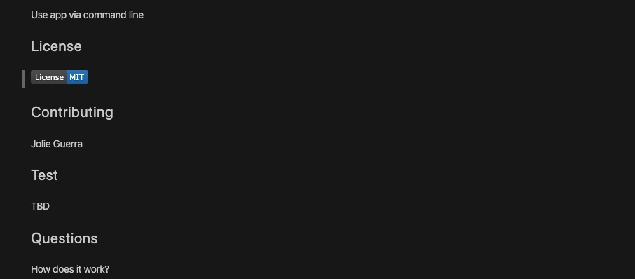

# Good README Generator

## Description
The README generator is a command line tool developed in node.js which allows you to quickly created a README.md file for Git repo.
In order to use the app you can run:

```sh
node index.js
```

the user will be prompted with a serious of prompts about themselves and the project like their GitHub username, which will be used to make a call to the GitHub API to retrieve their email and profile image. They will then be prompted with questions about their project.

The README will be populated with the following:

* At least one badge
* Project title
* Description
* Table of Contents
* Installation
* Usage
* License
* Contributing
* Tests
* Questions
  * User GitHub profile picture
  * User GitHub email

Once all the prompts have been answered a README.md file will be created. Below please see final README.md screenshots




